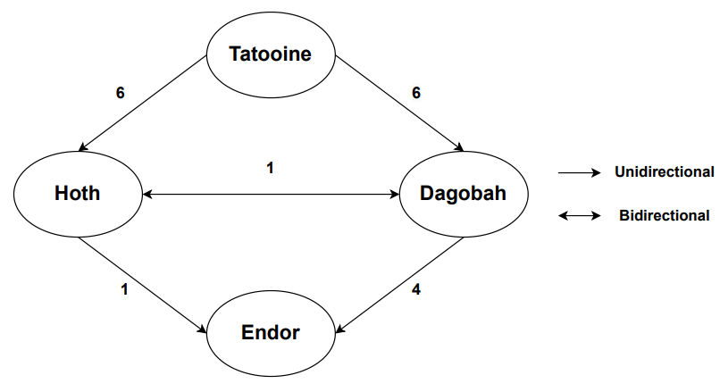

This repo contains the code base for the Giskard interview technical exercice.

The problem details and resources can be found in [Giskard Test](https://github.com/lioncowlionant/developer-test).

It consists of finding a path from a source planet (departure) to a target planet (within a specified time 
while avoiding encounters with bounty hunters.

Following the example provided in "millennium-falcon.json" file, the planets (Tatooine, Hoth, Dagobah, and Endor) form a connected graph, 
with Tatooine as the departure point and Endor as the arrival point. 

<p align="center">

</p>

I therefore approached the odds calculation as a problem-solving task and followed these steps:

1. Define unidirectional and bidirectional Edges connecting planets (nodes) and the formed graph.

2. Extract all possible paths from departure to arrival.

3. Verify possible paths given autonomy and countdown information.

4. Calculate probability of success (odds) based on bounty_hunters information.

 
Code details: 

1. [graph_paths.py](./utils/graph_paths.py) includes the necessary functions to look for all possible paths from departure to arrival.

2. [odds_calculation.py](./utils/odds_calculation.py) includes the functions needed to verify possible
paths and calculate calculate the chances of the Millennium Falcon reaching Endor on time and saving the galaxy. 

3. [config_backend.py](./config_files/config_backend.json) contains paths of "millennium-falcon.json" and routes sqlite database.

4. [backend.py](./backend.py) (Back-end) reads the json files (related to Millennium Falcon and Empire) and 
computes odds using functions from [graph_paths.py](./utils/graph_paths.py) and [odds_calculation.py](./utils/odds_calculation.py).

5. Front-end:
   - [index.html](./templates/index.html) represents a user interface template to upload the "empire.json" file.
   - [app_Frontend.py](./app_Frontend.py): (i) reads and sends json files to the backend using an API request. Then,
   (ii) makes an API request to the [backend.py](./backend.py) to fetch the calculated odds and update the user interface with the result.

   **How to use front-end**

   Run simultaneously: 
   ```
   python backend.py
   python app_Frontend.py
   ```
   I runned the web application on my local machine using the backend URL (obtained after running [backend.py](./backend.py)) .

   Note: I used the Flask framework for the front-end and back-end.


6. [app_CLI.py](./app_CLI.py) (CLI) takes two file paths as input, one for "millennium-falcon.json" and the other for "empire.json 
and reads their content. It sends it to the [backend.py](./backend.py) and prints odds.

   **How to use CLI** 

   First, run [backend.py](./backend.py):
   ```
   python backend.py
   ```

   Second, run [app_CLI.py](./app_CLI.py):
   ```
   python app_CLI.py examples/example1/millennium-falcon.json examples/example1/empire.json
   ```

**The specified packages and versions used to run this repository codes are listed in [requirements.yml](./requirements.yml).**
 
To create Conda environment and export requirements, you can use the following command:
```
conda env create -f requirements.yml
```
